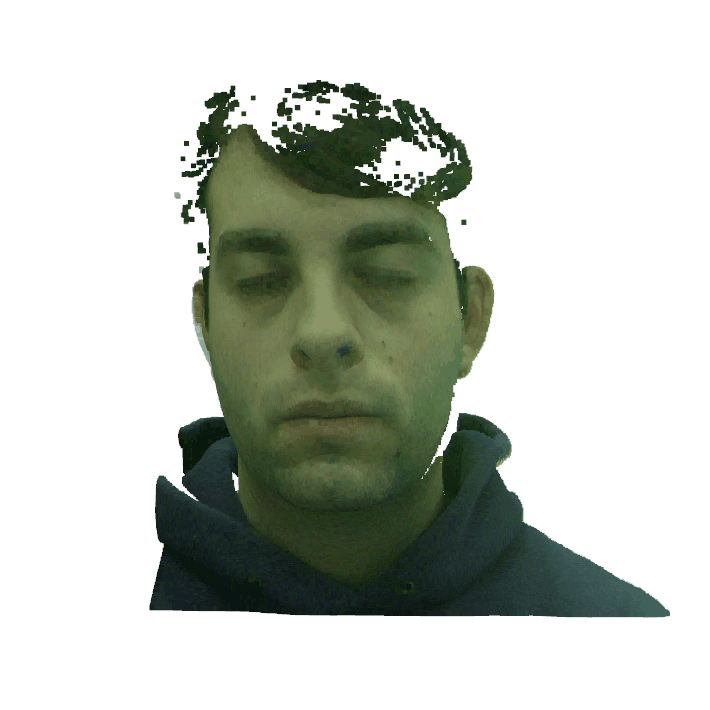
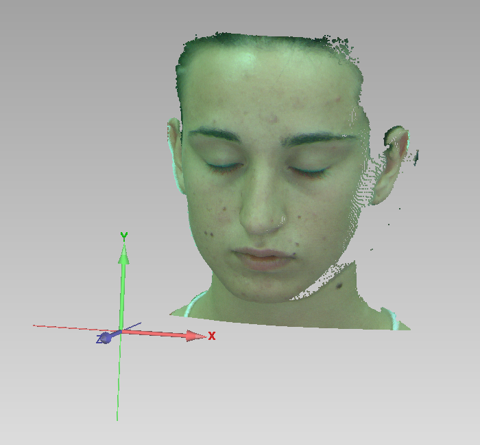

3Dface_landmark 
===================================  
This is a script for Piont Cloud facial landmark. This project can be used for facial 3D data key point detection, face detection, 3DMM face fitting, face recognition, etc.

Result  
-----------------------------------  
### show the source PLY file:
  

### show the 3D landmarks:  
  

### show the 3D landmarks with the PLY:
  

Start  
-----------------------------------  
### Prerequisite  
    python==3.7
    numpy==1.16.4
    dlib-compiled==19.16.99
    opencv-python==3.4.5.20
    open3d-python==0.7.0.0

### More   
  The point cloud file must be PLY, and the texture is required. In the PLY file, the face must towards the positive direction of the z axis and the head must towards the positive direction of the y axis.For example:
  

